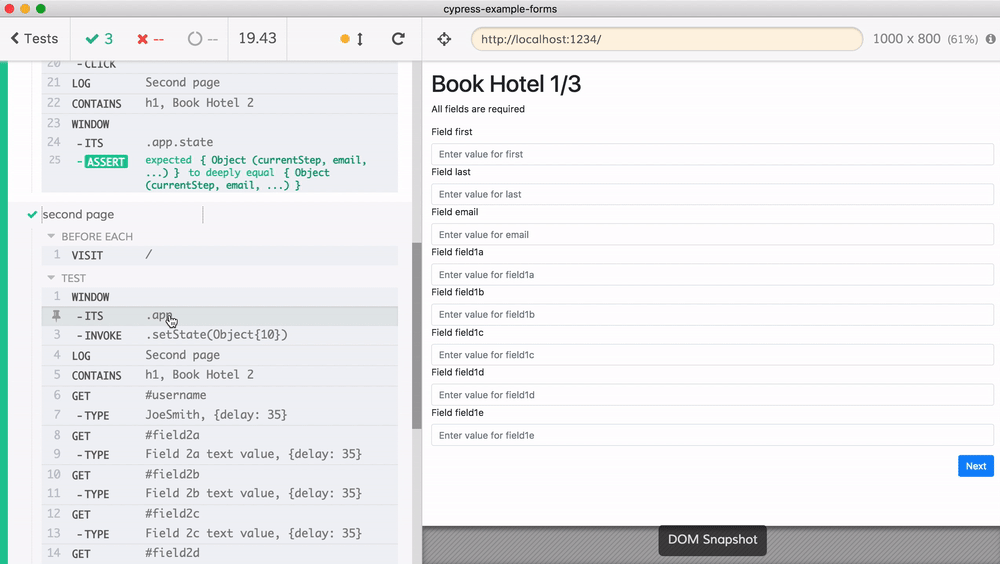

# cypress-example-forms [![renovate-app badge][renovate-badge]][renovate-app] [](https://circleci.com/gh/bahmutov/cypress-example-forms/tree/master)

Forms component is [uniforms](https://uniforms.tools/docs/tutorials-basic-uniforms-usage)

- [single-test.js](cypress/integration/single-test.js) shows a single long test that goes through the 3 pages of the form.
- [three-tests.js](cypress/integration/three-tests.js) splits this long test into 3 tests. Each test ends by confirming the internal application state, then a new test starts by setting that state. This sets the second test at the same checkpoint _as if the test went through the user interface_.

Main points

Application exposes its reference by setting it on the `window` object.

```js
// application code
class MasterForm extends React.Component {
  constructor (props) {
    super(props)
    if (window.Cypress) {
      window.app = this
    }
  }
  ...
}
```

Then the first test ends with a known state - we assert the internal state object.

```js
// end of the first test
const startOfSecondPageState = {...}
cy.contains('Next').click()

cy.log('Second page')
cy.contains('h1', 'Book Hotel 2')
cy.window()
  .its('app.state')
  .should('deep.equal', startOfSecondPageState)
```

The second test starts by visiting the application page and setting the state object.

```js
// start of the second test
cy.window()
  .its('app')
  .invoke('setState', startOfSecondPageState)

cy.log('Second page')
cy.contains('h1', 'Book Hotel 2')
```

Once the test invokes the `app.setState(...)` it "becomes" exactly as if the test went through the user interface filling the first page.



See more notes about this direct access from the Cypress test to the application in [Stop using Page Objects and Start using App Actions](https://www.cypress.io/blog/2019/01/03/stop-using-page-objects-and-start-using-app-actions/).

## License

This project is licensed under the terms of the [MIT license](/LICENSE.md).

[renovate-badge]: https://img.shields.io/badge/renovate-app-blue.svg
[renovate-app]: https://renovateapp.com/
